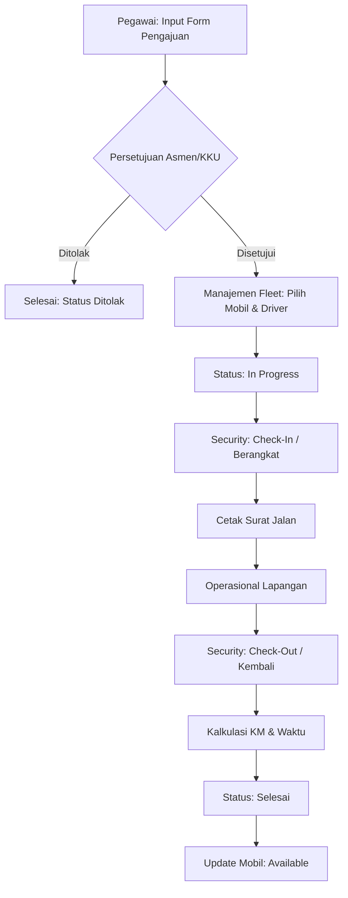

# Documentation E-Transport PLN UP2D RIAU

Dokumentasi lengkap mengenai sistem, alur kerja, struktur folder, dan catatan modifikasi.

## Daftar Isi
1. [Panduan Sidang](#1-panduan-sidang)
2. [Alur Sistem (Workflow)](#2-alur-sistem-workflow)
3. [Struktur Folder](#3-struktur-folder)
4. [Log Modifikasi (Enhancements)](#4-log-modifikasi-enhancements)

---

## 1. Panduan Sidang
Halo! Bagian ini disiapkan khusus untuk membantu dalam mempresentasikan sistem E-Transport PLN saat sidang.

### Poin Penting untuk Sidang (Key Presentation Points)
*   **Inovasi: Live Camera Capture**: Sistem tidak hanya mengandalkan upload file statis, tetapi bisa mengambil foto langsung melalui browser (WebRTC). Fitur ini meningkatkan integritas data.
*   **Logika Bisnis: Otonomi Bidang**: Asmen hanya bisa menyetujui bidang mereka masing-masing (Implementasi RBAC).
*   **Otomasi: Kalkulasi Logistik**: Sistem secara otomatis menghitung Jarak Tempuh (KM) dan Durasi Perjalanan untuk mengurangi human error.

---

## 2. Alur Sistem (Workflow)
Dokumen ini menjelaskan alur kerja aplikasi dari pengajuan hingga kendaraan kembali.

### Diagram Alur Utama (Activity Diagram)

### Penjelasan Tahapan
*   **Pengajuan**: User mengisi data tujuan dan keperluan.
*   **Persetujuan**: Asmen/KKU melakukan validasi digital (QR Code).
*   **Penugasan**: Fleet Manager memilih unit yang tersedia (`Available`).
*   **Pos Security**: Pengambilan foto bukti (Check-In/Out) dan input KM.

---

## 3. Struktur Folder
Aplikasi dibangun dengan pola **MVC (Model-View-Controller)** di atas CodeIgniter 3.

*   `/application/controllers`: Logika bisnis (Request, Approval, Fleet, Security).
*   `/application/models`: Interaksi database (`Transport_model.php`).
*   `/application/views/transport`: Seluruh tampilan antarmuka (UI).
*   `/uploads/transport`: Penyimpanan foto driver dan odometer.

---

## 4. Log Modifikasi (Enhancements)
*   **Fix Security Log DB**: Sinkronisasi kolom `logged_by`.
*   **Fix Detail View**: Implementasi JOIN tabel lengkap untuk data tracking.
*   **Live Camera Capture**: Fitur ambil foto real-time dengan pemilihan kamera (Front/Back).
*   **Digital Signature Scan**: QR Code yang informatif ("Surat ini telah di-Approve oleh...").
*   **Auto-Update Logistics**: Kalkulasi jarak dan waktu otomatis.

---
*Generated for PLN UP2D RIAU Final Project Documentation.*
