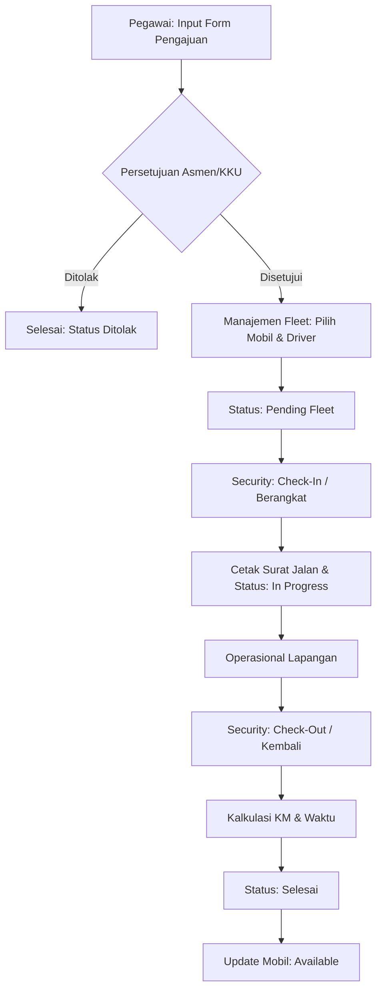

# DOKUMENTASI LENGKAP: SISTEM E-TRANSPORT PLN UP2D RIAU

Selamat datang di Dokumentasi Utama E-Transport. Dokumen ini dirancang sebagai panduan komprehensif untuk pengembang, admin, dan bahan materi Sidang Tugas Akhir yang menjelaskan alur, fitur, peran, dan struktur data secara detail.

---

## 1. PENDAHULUAN & FITUR UTAMA
Sistem E-Transport adalah platform digital untuk mengelola perjalanan dinas pegawai PLN UP2D Riau, mulai dari pengajuan hingga pemantauan unit kendaraan.

### Fitur Unggulan:
- **Live Camera Capture**: Pengambilan foto driver dan odometer secara real-time via WebRTC untuk validasi di pos security.
- **Digital Approval Hierarchy**: Persetujuan berjenjang berdasarkan bidang kerja user.
- **Fleet Management**: Pengaturan unit armada dan penugasan pengemudi yang terintegrasi.
- **Automated Logging**: Kalkulasi otomatis jarak tempuh (KM) dan durasi perjalanan.
- **Surat Jalan Digital**: Generate PDF surat jalan profesional dengan sistem validasi digital.

---

## 2. PERAN & WEWENANG (ROLES & RESPONSIBILITIES)
Sistem menggunakan **Role-Based Access Control (RBAC)** untuk memastikan setiap fungsi dijalankan oleh personil yang tepat:

| Role | Tanggung Jawab Utama |
| :--- | :--- |
| **User Bidang** | Mengisi form pengajuan dari bidang masing-masing (Perencanaan, Pemeliharaan, Operasi, Fasop, dll). |
| **Asmen (Assistant Manager)** | Melakukan verifikasi dan menyetujui/menolak pengajuan berdasarkan bidang masing-masing. |
| **KKU (Kepala Keuangan & Umum)** | Menyetujui pengajuan lintas bidang dan bertindak sebagai manajer armada (Fleet Manager). |
| **Admin Fleet** | Menugaskan unit mobil fisik dan pengemudi (driver) untuk permohonan yang telah disetujui. |
| **Security** | Melakukan Check-In (saat mobil keluar) dan Check-Out (saat mobil kembali) dengan bukti foto kamera live. |
| **Administrator** | Manajemen user (tambah/hapus/nonaktifkan) dan monitoring dashboard global. |

---

## 3. ALUR KERJA SISTEM (WORKFLOW & APPROVALS)

### A. Lifecycle Permohonan (Status Transitions)
1.  **Pending Asmen**: Keadaan awal setelah pegawai melakukan submit form.
2.  **Pending Fleet**: Keadaan setelah Asmen memberikan persetujuan (Approved).
3.  **In Progress**: Keadaan setelah mobil dan driver ditugaskan, dan security klik "Berangkat" (Check-In).
4.  **Selesai**: Keadaan akhir setelah mobil kembali dan security klik "Kembali" (Check-Out).
5.  **Ditolak**: Keadaan jika Asmen atau KKU tidak memberikan izin perjalanan.

### B. Flowchart Alur Sistem (Activity Diagram)

### C. Detail Proses Approval
- **Sistem Cerdas**: Permohonan dari Bagian Perencanaan akan muncul secara otomatis di dashboard Asmen Perencanaan.
- **Validasi Digital**: Setiap persetujuan tercatat secara permanen dalam database dengan timestamp dan identitas penyetuju yang otentik.

---

## 4. STRUKTUR DATABASE (DATA REQUIREMENTS)
Sistem ini menggunakan basis data relasional MySQL dengan skema yang terintegrasi:

### A. Tabel Utama E-Transport:
- **`transport_requests`**: Menyimpan data dasar perjalanan (Nama, Tujuan, Keperluan, Tanggal Berangkat).
- **`transport_approvals`**: Menyimpan log persetujuan (ID Asmen, Keputusan, Catatan, Timestamp).
- **`transport_fleet`**: Menyimpan penugasan unit (Mobil, Plat Nomor, Nama Pengemudi).
- **`transport_security_logs`**: Menyimpan data operasional real-time (KM Awal/Akhir, Jam Berangkat/Kembali, Foto Odometer).
- **`transport_vehicles`**: Master data armada kantor.

### B. Relasi Data:
- Primary Key (PK) `id` pada `transport_requests` menjadi Foreign Key (FK) `request_id` di tabel log (`approvals`, `fleet`, `security`).
- Relasi antara `transport_fleet` dan `transport_vehicles` dihubungkan melalui `plat_nomor`.

---

## 5. MANAJEMEN KENDARAAN (VEHICLE DATA)
Data mobil dikelola secara dinamis untuk efisiensi operasional.

### Atribut Data Mobil (`transport_vehicles`):
- **Brand & Model**: Merk dan tipe spesifik (Contoh: Toyota Innova, Daihatsu Terios).
- **Plat Nomor**: Identitas unik kendaraan.
- **Status Kendaraan**:
    - `Available`: Siap digunakan.
    - `In Use`: Sedang digunakan dalam perjalanan dinas.

### Logika Ketersediaan:
Saat security melakukan **Check-In**, status mobil di database otomatis berubah menjadi `In Use`.
Saat security melakukan **Check-Out**, status mobil otomatis kembali menjadi `Available`.

---

## 6. TEKNOLOGI & METODOLOGI (DEVELOPMENT SPECS)
Sistem ini telah dimigrasikan ke arsitektur modern untuk performa dan keamanan maksimal:
- **Framework**: **Next.js 15 (Full-Stack)** dengan App Router.
- **Database ORM**: **Prisma**, memberikan tipe data yang aman (Type-safe) dan query efisien ke MySQL.
- **Styling**: **Tailwind CSS**, dengan desain **Light Theme** yang premium dan responsif.
- **Kamera**: **React hooks + WebRTC API** untuk pengambilan foto live di berbagai perangkat.
- **Security**: **JWT (JSON Web Token)** untuk autentikasi API dan **Bcrypt** untuk enkripsi password.

---
*Dokumentasi ini diperbarui pada Januari 2026 sebagai panduan final sistem E-Transport PLN UP2D Riau berbasis Full-Stack Next.js.*
