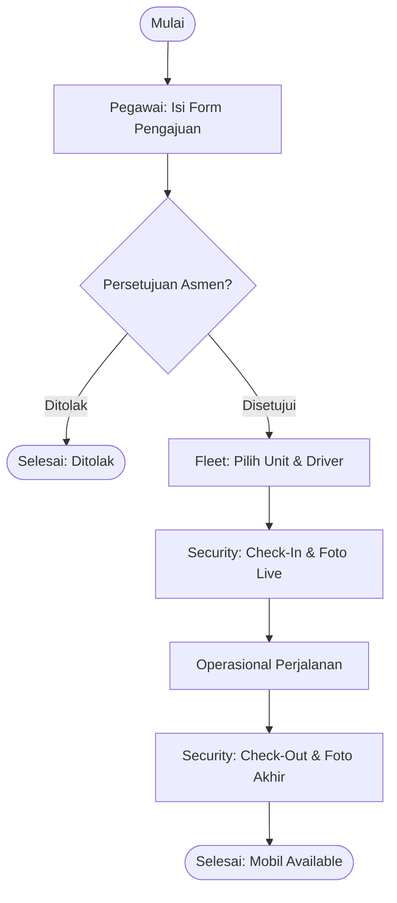
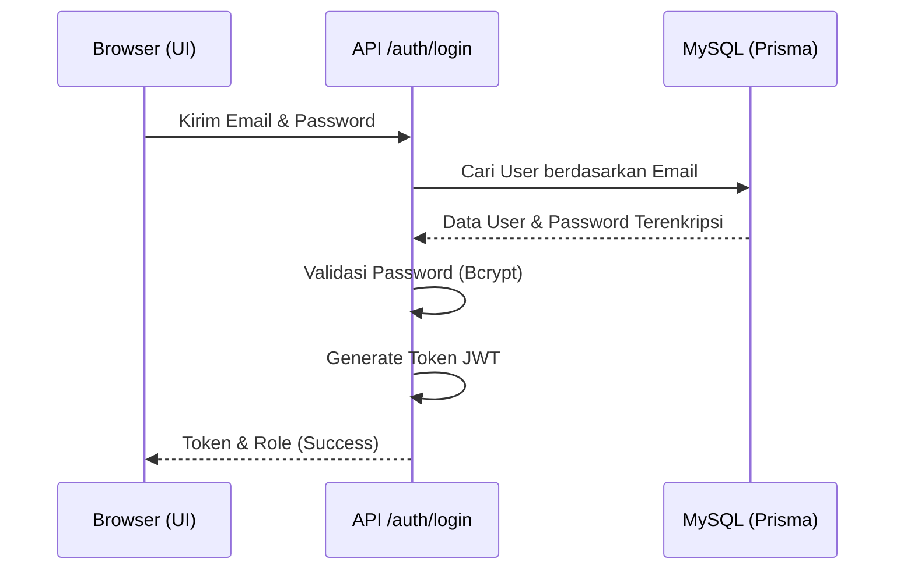
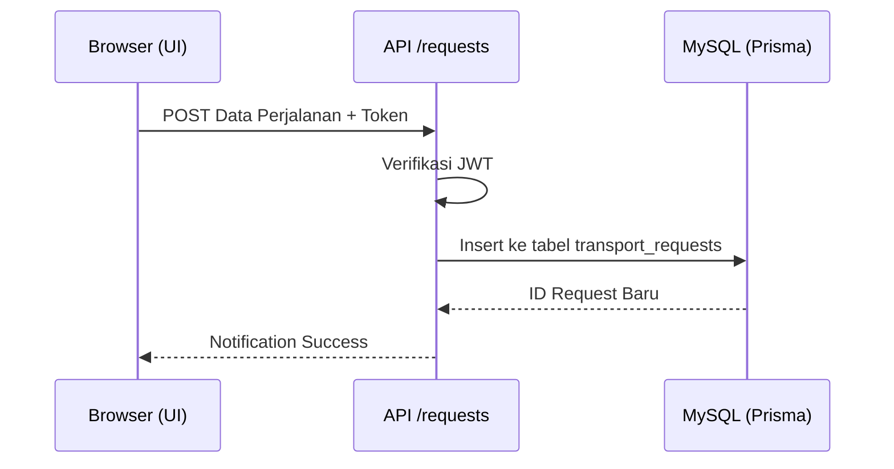
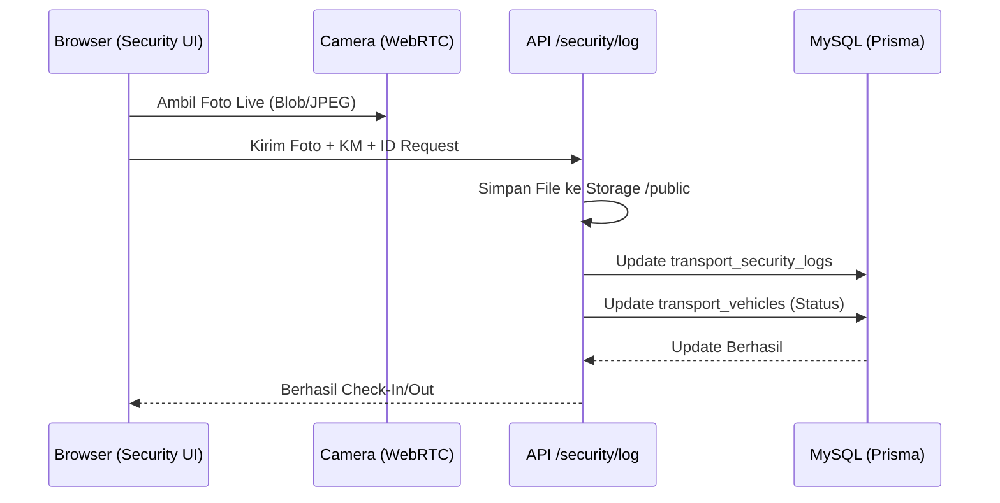

# DOKUMENTASI STRATEGIS & TEKNIS: E-TRANSPORT PLN UP2D RIAU

Dokumen ini adalah panduan tunggal komprehensif yang menggabungkan aspek operasional dan arsitektur teknis sistem E-Transport. Dirancang sebagai materi utama untuk monitoring sistem dan bahan presentasi Sidang Tugas Akhir.

---

## 1. ARSITEKTUR FOLDER (FULL-STACK NEXT.JS)
Sistem telah dimigrasikan sepenuhnya ke JavaScript (Next.js 16). Berikut adalah pembagian folder berdasarkan fungsinya:

### A. Backend (Logika & API)
Seluruh logika server-side berada di direktori root dan sub-folder `api`:
- **`/app/api/`**: Berisi seluruh endpoint API (Routes). Setiap folder di dalamnya merepresentasikan fungsi (Contoh: `api/requests`, `api/approval`).
- **`/lib/prisma.js`**: Konfigurasi koneksi database menggunakan Prisma ORM.
- **`/lib/auth.js`**: Logika autentikasi dan verifikasi JWT.
- **`/prisma/schema.prisma`**: Definisi skema database dan relasi antar tabel.

### B. Frontend (Antarmuka & UI)
Bagian yang berinteraksi langsung dengan pengguna:
- **`/app/`**: Folder utama untuk halaman (Pages). Contoh: `app/dashboard/`, `app/request/form/`.
- **`/components/`**: Komponen UI yang dapat digunakan kembali (Sidebar, Navbar, Toast, Live Camera).
- **`/public/`**: Asset statis seperti logo PLN, gambar latar belakang, dan folder `uploads` untuk foto operasional.

---

## 2. USE CASE DIAGRAM
Menggambarkan interaksi antara aktor (personil) dengan fungsionalitas sistem.

```mermaid
usecaseDiagram
    actor "Pegawai/User" as U
    actor "Asmen/KKU" as A
    actor "Admin Fleet" as F
    actor "Security" as S
    actor "Administrator" as AD

    U --> (Input Pengajuan)
    U --> (Cek Status)
    A --> (Verifikasi & Approval)
    F --> (Penugasan Mobil & Driver)
    S --> (Check-In: Foto KM & Driver)
    S --> (Check-Out: Foto KM & Driver)
    AD --> (Manajemen Akun)
    AD --> (Monitoring Dashboard)
```

---

## 3. FLOWCHART SISTEM (ACTIVITY DIAGRAM)
Alur proses bisnis dari awal pengajuan hingga kendaraan kembali ke kantor.



---

## 4. API SEQUENCE DIAGRAMS
Detail teknis urutan pesan antar objek/sistem untuk setiap proses utama.

### A. Autentikasi (Login)


### B. Pengajuan Transport (Request)


### C. Operasional Security (Live Camera Capture)


---

## 5. REKAP TEKNOLOGI (TECH STACK)
Sistem ini dibangun dengan pondasi teknologi terkini untuk menjamin skalabilitas:
1.  **Framework**: Next.js 16.1 (Modern JavaScript Platform).
2.  **Language**: JavaScript / Node.js.
3.  **ORM**: Prisma (Type-safe Database Access).
4.  **Database**: MySQL (Reliable Data Storage).
5.  **Design**: Vanilla CSS & Tailwind CSS (Premium UI Look).
6.  **Real-time Capture**: WebRTC API.

---
*Dokumen ini merupakan satu-satunya acuan resmi (Single Source of Truth) untuk sistem E-Transport PLN UP2D Riau.*
