# DOKUMENTASI STRATEGIS & TEKNIS: E-TRANSPORT PLN UP2D RIAU

Dokumen ini adalah panduan tunggal komprehensif yang menggabungkan aspek operasional dan arsitektur teknis sistem E-Transport. Dirancang sebagai materi utama untuk monitoring sistem dan bahan presentasi Tugas Akhir.

---

## 1. PENDAHULUAN
**E-Transport** adalah sistem manajemen armada kendaraan dinas digital yang mengotomatisasi seluruh siklus peminjaman kendaraan di lingkungan PLN UP2D RIAU. Sistem ini menggantikan proses manual dengan alur kerja digital yang terintegrasi, mulai dari pengajuan, persetujuan, penugasan armada, hingga pemantauan pintu keluar/masuk oleh petugas keamanan.

---

## 2. REKAP TEKNOLOGI (TECH STACK)
Sistem ini dibangun dengan pondasi teknologi modern untuk menjamin performa dan skalabilitas:

| Komponen | Teknologi | Keterangan |
| :--- | :--- | :--- |
| **Framework** | Next.js 15.1 | Platform React modern dengan App Router. |
| **Bahasa** | JavaScript / Node.js | Standar industri untuk aplikasi web cepat. |
| **Database** | MySQL | Penyimpanan data relasional yang handal. |
| **ORM** | Prisma | Akses database yang aman (Type-safe). |
| **Keamanan** | JWT & Bcrypt | Autentikasi token & enkripsi password. |
| **UI/UX** | Vanilla CSS + Tailwind | Desain premium, modern, dan responsif. |
| **Fitur Kamera** | WebRTC API | Pengambilan foto live tanpa plugin tambahan. |
| **Deployment** | Vercel | Infrastruktur cloud untuk ketersediaan tinggi. |

---

## 3. STRUKTUR PROYEK & FUNGSIONALITAS FILE
Berikut adalah rincian file utama yang mendefinisikan logika sistem:

### A. Folder Core & Utilities (`/lib`)
| File | Fungsi Utama |
| :--- | :--- |
| [prisma.js](file:///Users/nia/Documents/transport_pln%20copy/lib/prisma.js) | Singleton instance untuk koneksi Database. |
| [auth.js](file:///Users/nia/Documents/transport_pln%20copy/lib/auth.js) | Middlewire verifikasi token JWT pada sisi server. |
| [notifications.js](file:///Users/nia/Documents/transport_pln%20copy/lib/notifications.js) | Engine pengiriman notifikasi antar role. |
| [api.js](file:///Users/nia/Documents/transport_pln%20copy/lib/api.js) | Wrapper API Frontend untuk komunikasi data yang aman. |

### B. Komponen Bersama (`/components`)
| Nama Komponen | Kegunaan |
| :--- | :--- |
| [Sidebar.js](file:///Users/nia/Documents/transport_pln%20copy/components/Sidebar.js) | Navigasi cerdas yang berubah sesuai Role pengguna. |
| [CameraCapture.js](file:///Users/nia/Documents/transport_pln%20copy/components/CameraCapture.js) | Modul kamera untuk petugas security (Check-in/out). |
| [Toast.js](file:///Users/nia/Documents/transport_pln%20copy/components/Toast.js) | Sistem notifikasi visual (Success/Error/Warning). |
| [Shell.js](file:///Users/nia/Documents/transport_pln%20copy/components/Shell.js) | Layout utama yang menjaga keamanan halaman (Auth Guard). |

### C. Backend API Routes (`/app/api/...`)
| Endpoint | Deskripsi Proses |
| :--- | :--- |
| `/api/auth/login` | Validasi kredensial dan pembuatan Token JWT. |
| `/api/requests` | Manajemen siklus hidup permohonan kendaraan. |
| `/api/approval` | Logika persetujuan oleh Asmen dan KKU. |
| `/api/fleet` | Penugasan unit kendaraan dan driver oleh Fleet Admin. |
| `/api/security` | Pencatatan log operasional (KM & Foto) di gerbang. |

---

## 4. ROLE & PERMISSIONS (HAK AKSES)
Sistem ini mengimplementasikan Role-Based Access Control (RBAC) yang ketat:

| Role | Hak Akses Utama |
| :--- | :--- |
| **Pemohon** | Input pengajuan, revisi data, monitoring riwayat pribadi. |
| **Asmen** | Persetujuan awal (bidang terkait) & monitoring pengajuan. |
| **KKU** | Persetujuan final & manajemen notifikasi penugasan. |
### 3. Perbaikan Bug & Optimasi
- **Fix**: Memperbaiki variabel undefined pada API hapus user.
- **Optimasi**: Implementasi penanganan parameter dinamis (`params`) yang kompatibel dengan Next.js versi terbaru pada seluruh route dinamis.
- **Security**: Implementasi fitur **Auto-Logout** otomatis jika pengguna tidak melakukan aktivitas (mouse/keyboard/scroll) selama **10 menit** untuk meningkatkan keamanan workstation.

## Dokumentasi Teknis

| **Security** | Dokumentasi real-time (Check-in/Check-out pintu masuk). |
| **Admin IT** | Manajemen akun pengguna & pemeliharaan teknis sistem. |

---

## 5. DIAGRAM SISTEM (MERMAID)

### A. Use Case Diagram
Mendefinisikan interaksi personil dengan sistem.

```mermaid
graph LR
    U["👤 Pegawai/User"]
    A["👔 Asmen/KKU"]
    F["🚗 Fleet Admin"]
    S["🛡️ Security"]
    AD["💻 IT Admin"]
    
    UC1((Input<br/>Pengajuan))
    UC2((Cek<br/>Status))
    UC3((Verifikasi &<br/>Approval))
    UC4((Assign Mobil<br/>& Driver))
    UC5((Cetak<br/>Surat Jalan))
    UC6((Check-In:<br/>Foto KM))
    UC7((Check-Out:<br/>Foto KM))
    UC8((Manajemen<br/>User))
    UC9((Monitoring<br/>Log Sistem))
    
    U -.-> UC1
    U -.-> UC2
    A -.-> UC3
    F -.-> UC4
    F -.-> UC5
    S -.-> UC6
    S -.-> UC7
    AD -.-> UC8
    AD -.-> UC9
    
    style UC1 fill:#fff,stroke:#000,stroke-width:2px
    style UC2 fill:#fff,stroke:#000,stroke-width:2px
    style UC3 fill:#fff,stroke:#000,stroke-width:2px
    style UC4 fill:#fff,stroke:#000,stroke-width:2px
    style UC5 fill:#fff,stroke:#000,stroke-width:2px
    style UC6 fill:#fff,stroke:#000,stroke-width:2px
    style UC7 fill:#fff,stroke:#000,stroke-width:2px
    style UC8 fill:#fff,stroke:#000,stroke-width:2px
    style UC9 fill:#fff,stroke:#000,stroke-width:2px
    style U fill:#fff,stroke:#000,stroke-width:2px
    style A fill:#fff,stroke:#000,stroke-width:2px
    style F fill:#fff,stroke:#000,stroke-width:2px
    style S fill:#fff,stroke:#000,stroke-width:2px
    style AD fill:#fff,stroke:#000,stroke-width:2px
```

### B. Flowchart Operasional
Alur kerja dari pengajuan hingga kendaraan kembali ke pangkalan.

### C. Sequence Diagram (Authentication)
Proses teknis keamanan masuk ke sistem.

---

## 6. PEMELIHARAAN SISTEM
## Fitur Keamanan (Security Features)

Sistem E-Transport dilengkapi dengan beberapa layer keamanan untuk melindungi integritas data dan akses pengguna.

| Fitur | Deskripsi | Implementasi |
| :--- | :--- | :--- |
| **Autentikasi JWT** | Menggunakan JSON Web Token untuk verifikasi sesi API. | `lib/auth.js` |
| **Password Hashing** | Password disimpan dalam format hash menggunakan Bcrypt. | `app/api/auth/login` |
| **Auto-Logout (Idle)** | Sistem otomatis logout jika pengguna tidak aktif selama **10 menit**. | `components/Shell.js` |
| **QR Signature** | Verifikasi keaslian dokumen melalui tanda tangan digital QR. | `app/api/verify` |
| **RBAC** | Pembatasan akses fitur berdasarkan peran (Role) pengguna. | `components/Shell.js` |

---
1.  **Backup Database**: Gunakan dump MySQL secara berkala pada tabel `transport_requests` dan `users`.
2.  **Pembersihan Log**: Foto security yang tersimpan di `/public/uploads` dapat diarsipkan setiap 6 bulan.
3.  **Update Security**: Selalu perbarui `JWT_SECRET` pada file environment jika terindikasi kebocoran data.

---
*Dokumen ini merupakan satu-satunya acuan resmi (Single Source of Truth) untuk pemeliharaan dan pengembangan sistem E-Transport PLN UP2D Riau.*
