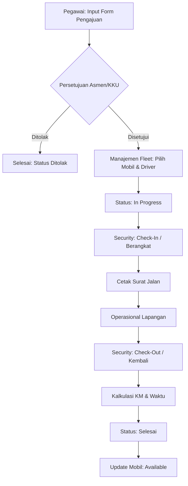

# Alur Sistem E-Transport PLN

Dokumen ini menjelaskan alur kerja (workflow) dari aplikasi E-Transport, mulai dari pengajuan hingga kendaraan kembali ke kantor.

## 1. Diagram Alur Utama (Activity Diagram)

## 2. Penjelasan Tahapan (SOP)

### A. Pengajuan (Request Phase)
- **Aktor**: Seluruh Pegawai (Role: User).
- **Aksi**: Mengisi data tujuan, keperluan, jenis kendaraan yang diminta, dan estimasi waktu.
- **Output**: Record baru di tabel `transport_requests` dengan status **"Pending Asmen/KKU"**.

### B. Persetujuan (Approval Phase)
- **Aktor**: Asisten Manajer (Asmen) atau Kepala Kamanan & Umum (KKU).
- **Logika**: 
    - Asmen memfilter pengajuan berdasarkan **Bagian/Bidang** mereka sendiri.
    - KKU menyetujui bidang non-teknis (Umum/Keuangan/SDM).
- **Output**: Penandatanganan digital (Barcode) dan status berubah menjadi **"Pending Fleet"**.

### C. Penugasan Armada (Fleet Phase)
- **Aktor**: Admin KKU / Manajemen Fleet.
- **Aksi**: Memilih unit kendaraan fisik (berdasarkan plat nomor) dan pengemudi.
- **Validasi**: Sistem hanya menampilkan mobil yang berstatus **"Available"**.
- **Output**: Status mobil berubah menjadi **"In Use"**, status permohonan menjadi **"In Progress"**.

### D. Pos Security (Operational Phase)
- **Aktor**: Petugas Security.
- **Check-In (Berangkat)**: 
    - Mengambil foto driver dan odometer (KM Awal) menggunakan **Live Camera Capture**.
    - Mencetak Surat Jalan fisik untuk dibawa driver.
- **Check-Out (Kembali)**:
    - Mengambil foto bukti kepulangan.
    - Menginput KM Akhir.
    - Sistem menghitung **Jarak Tempuh** dan **Durasi Perjalanan** secara otomatis.

## 3. Sinkronisasi Status Kendaraan
Salah satu fitur krusial adalah manajemen asset:
1. Saat **Fleet** ditugaskan -> Mobil: `In Use`.
2. Saat **Security Check-Out** selesai -> Mobil: `Available` (otomatis bisa dipinjam lagi).

---
*Dokumen ini disusun untuk bahan Sidang Tugas Akhir / Presentasi Sistem.*
